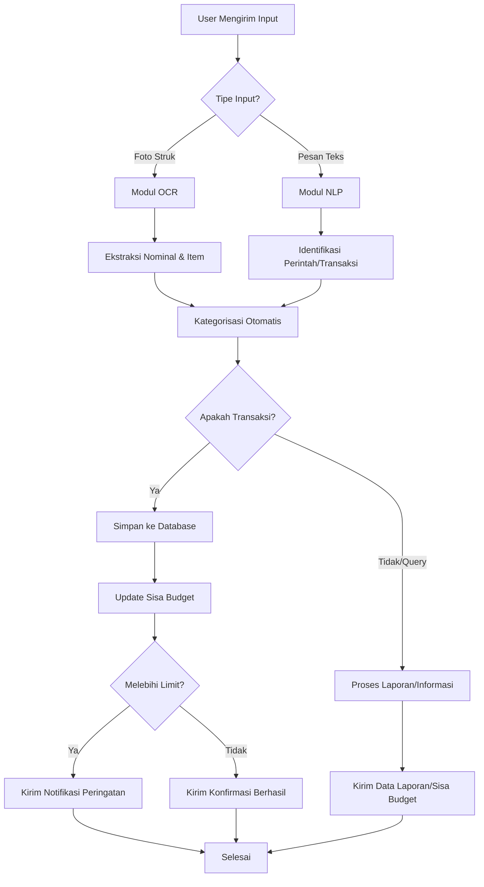

# Flowchart Bisnis FinBot

Berikut adalah alur proses bisnis dari FinBot menggunakan diagram Mermaid:

### Penjelasan Singkat:
1. **Input**: User bisa mengirimkan gambar struk atau teks biasa.
2. **Processing**: Sistem membedakan antara kebutuhan ekstraksi data (OCR) atau pemahaman bahasa (NLP).
3. **Categorization**: Data yang didapat diklasifikasikan ke kategori yang sesuai.
4. **Database**: Semua data transaksi disimpan untuk pelacakan jangka panjang.
5. **Budget Check**: Setiap transaksi divalidasi terhadap limit anggaran yang sudah diatur user.
6. **Output**: Bot memberikan respon balik berupa konfirmasi, peringatan, atau laporan yang diminta.
