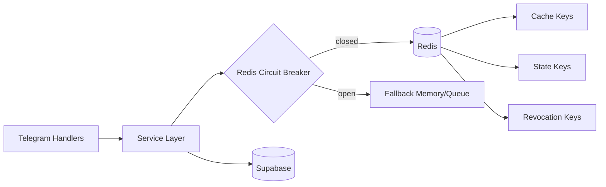

# Redis Architecture Migration

## Key Namespace + TTL
- `user:{id}:profile` TTL `600s`
- `user:{id}:budget:{month}:{year}` TTL `300s`
- `user:{id}:telemetry_consent` TTL `31536000s`
- `user:{id}:reminder_*` TTL sesuai fitur (`24h` untuk snooze)
- `user:{id}:recurring:templates` TTL `30d`
- `user:{id}:recurring:last_reminded:{sig}` TTL `24h`
- `user:{id}:autopilot:proposals` TTL `7d`
- `auth:revoked:{token_fingerprint}` TTL `token_expiry`
- `ux:events` rolling list trim 50k

## Circuit Breaker
- Threshold: 3 failures (`REDIS_CB_THRESHOLD`)
- Open cooldown: 15s (`REDIS_CB_COOLDOWN_SECONDS`)
- Closed -> Open when failures >= threshold
- Open -> Half-open implicit on next allowed attempt after cooldown
